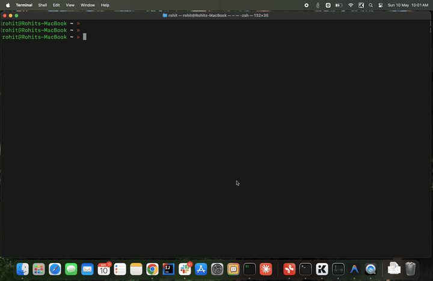
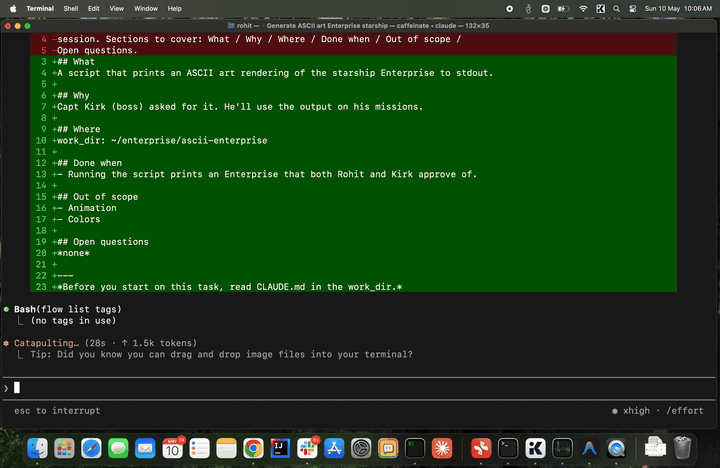
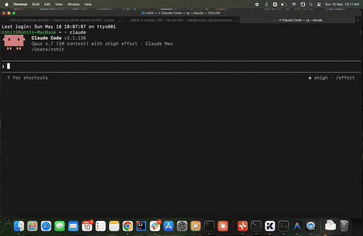

<p align="center">
  
</p>

<p align="center">
  <a href="https://facets-cloud.github.io/flow/"><strong>Website</strong></a> ·
  <a href="#install">Install</a> ·
  <a href="#see-it-in-action">Demo</a> ·
  <a href="CHANGELOG.md">Changelog</a>
</p>

<p align="center">
  
  
</p>

> A complete task manager for Claude Code — and the working memory
> layer that turns every session from a brilliant new hire into the
> engineer on your team.

## See it in action

A four-act demo of how flow compounds context across days and tasks.
The work is silly on purpose — Star Trek bridge starships — so the
mechanic is what you watch, not the code.

**Act 1 — Capture the work.** Just talk. flow interviews you for
what / why / where / done-when, drafts a structured brief, and opens
a dedicated Claude session for the task in a new tab.



**Act 2 — Work, then park.** The session has the brief, the project
context, and the knowledge base loaded. You build until you hit a
blocker — here, "Kirk needs to review this" — and tell Claude to
park it. Status flips to `waiting`. Tab can close.



**Act 3 — Resume and close.** A day later you say "Kirk signed off."
Same session resumes with full memory of where it left off. `flow
done` flips status and triggers the sweep — Claude re-reads the
whole transcript and writes durable facts (Kirk approved the design,
the ship class, the conventions used) into the knowledge base.



**Act 4 — Months later, a new captain.** New task: "Picard's the new
boss, he wants the starship as an SVG." Brand new session, but it
already knows the ship, knows the design choices Kirk approved,
knows the project conventions — because the KB carried it. Claude
just gets to work.


That fourth session is what flow is really about. Not the first
session — the fiftieth.

## Why flow

If you use Claude Code daily, you've felt the ceiling: every session
is a new hire. Brilliant, capable, ready to help — but with no memory
of yesterday's decisions, last week's migrations, or the half-finished
threads in your other tabs. You spend the first ten minutes of every
session catching it up.

flow changes the relationship. It's a complete task manager —
projects, tasks, structured briefs, progress notes, playbooks for
recurring work — *and* a working memory layer that injects all of it
into every Claude session automatically. Capture once, work with
Claude on it forever.

The first session feels normal. By session ten, Claude knows your
codebase quirks, your team, the customer you keep mentioning, and
the migration you're three steps into. By session fifty, it's the
engineer on your team — not a new hire you re-explain yourself to
every morning.

Built for power users who want Claude to *work with them*, not just
*help them*.

## How context compounds

Every task feeds the same knowledge base. Every closed task makes
the next one smarter.

```
                                       ┌────────────────────────┐
                                       │   ~/.flow/kb/          │
                                       │   user · org · products│
                                       │   processes · business │
                                       └─────▲──────────▲───────┘
                                             │          │
                  flow do <task>             │ scoop    │ sweep
   ┌────────┐  ─────────────────▶  ┌─────────┴──────────┴─────┐
   │  Task  │                      │      Claude session      │
   │  brief │  ◀──── updates ───── │  loads brief + kb +      │
   │ +notes │                      │  notes + repo conventions│
   └────────┘  ─── flow done ───▶  └──────────────────────────┘
                                       (auto-sweep transcript
                                        into kb on done)
```

- **Scoop (live):** during a session the flow skill listens for
  durable facts you mention — your role, a teammate's name, a
  product convention — and appends them to the matching kb file
  on the fly.
- **Sweep (on `flow done`):** when you close a task, flow spawns
  a headless Claude pass that re-reads the entire transcript and
  pulls anything kb-worthy that the live scoop missed. The status
  flip is the contract; the sweep is best-effort.
- **Cross-reference:** `flow transcript <sibling-task>` lets a
  current session read what was decided in a related one — useful
  when the brief alone doesn't carry enough context.

Net effect: the longer you use flow, the more your knowledge base
grows, the less you re-explain yourself.

## Playbooks for the work you do on cadence

Some work repeats. Weekly reviews. Daily PR triage. On-call rotations.
Customer-meeting prep.

A **playbook** is a reusable run definition — a markdown brief that
describes what a run does. `flow run playbook weekly-review` snapshots
that brief into a fresh task and spawns a new Claude session against
it. Every run is reproducible (it executes against a frozen snapshot,
so editing the playbook later doesn't rewrite history) and contributes
back to the knowledge base on `flow done` like any other task.

```
┌──────────┐  flow run playbook weekly-review
│ Playbook │ ────────▶ snapshot ─────▶ new task ─────▶ new session
│  brief   │           (frozen for                     (executes
└──────────┘            reproducibility)                against snapshot)
```

Same compounding mechanic — your weekly review session two months from
now will know everything every prior weekly review surfaced.

## Install

In any Claude Code session, paste this:

> Install flow from https://github.com/Facets-cloud/flow

Claude reads the repo, downloads the binary, and runs `flow init` —
which installs the flow skill into `~/.claude/skills/flow/SKILL.md`
and registers a SessionStart hook so every future Claude session
loads the skill automatically. Then say **"let's get to work"** and
follow along.

<details>
<summary>Manual install (curl + chmod + flow init)</summary>

```bash
# 1. Download the binary for your Mac.
ARCH=arm64        # Apple Silicon (M1/M2/M3/M4) — use amd64 for Intel.

curl -fsSL -o /usr/local/bin/flow \
  "https://github.com/Facets-cloud/flow/releases/latest/download/flow-darwin-${ARCH}"
chmod +x /usr/local/bin/flow
xattr -d com.apple.quarantine /usr/local/bin/flow 2>/dev/null || true

# 2. Initialize. This is required — it creates ~/.flow/, the SQLite
#    index, the knowledge base, AND installs the Claude skill +
#    SessionStart hook. Without this step, Claude can't talk to flow.
flow init
```

`flow init` is the step that wires flow into Claude Code. It:

- Creates `~/.flow/` (database, kb, projects, tasks, playbooks)
- Writes the flow skill to `~/.claude/skills/flow/SKILL.md`
- Adds a SessionStart hook to `~/.claude/settings.json` so every new
  Claude Code session auto-loads the skill

The `xattr` step removes Gatekeeper's quarantine attribute so macOS
doesn't refuse to run the unsigned binary.

</details>

<details>
<summary>Manual install on Windows (PowerShell)</summary>

```powershell
# 1. Download the binary for your PC. Use amd64 for most machines;
#    arm64 for Windows on ARM.
$arch = "amd64"
$dir  = "$env:LOCALAPPDATA\Programs\flow"
New-Item -ItemType Directory -Force -Path $dir | Out-Null
Invoke-WebRequest -UseBasicParsing `
  -Uri "https://github.com/Facets-cloud/flow/releases/latest/download/flow-windows-$arch.exe" `
  -OutFile "$dir\flow.exe"

# 2. Add the folder to your user PATH (open a new terminal afterward).
[Environment]::SetEnvironmentVariable(
  "Path", [Environment]::GetEnvironmentVariable("Path", "User") + ";$dir", "User")

# 3. Initialize. Creates %USERPROFILE%\.flow\ and installs the Claude
#    skill + SessionStart hook into %USERPROFILE%\.claude\.
flow init
```

The binary is unsigned, so SmartScreen may warn on first run — choose
**More info → Run anyway**. flow opens interactive sessions in
**Windows Terminal** (`wt.exe`); for a headless setup with no terminal
tab, set `FLOW_TERM=bg` to use Claude Code background agents instead.

</details>

## Upgrade

In any Claude Code session:

> Upgrade flow from https://github.com/Facets-cloud/flow

Claude fetches the latest release binary and runs `flow skill
update` to refresh the skill and re-wire the SessionStart and
UserPromptSubmit hooks. Check the running version with
`flow --version`.

## Quickstart

Just open Claude and say **"let's get to work"**. The skill
handles the rest.

## What you get

- **One task, one Claude session, one tab.** `flow do <task>`
  spawns a dedicated tab in iTerm2, Warp, stock macOS Terminal, kitty
  (requires `allow_remote_control yes` in `kitty.conf`), or your
  current zellij session (requires zellij ≥ 0.40) — flow picks
  whichever you launched it from. Override with
  `FLOW_TERM=warp|iterm|terminal|zellij|kitty` when you're on a
  non-standard host — or set `FLOW_TERM=bg` to launch the session as a
  **terminal-free Claude background agent** (Claude Code's Agent View,
  `claude agents`) with no tab at all. Tomorrow's `flow do <task>`
  resumes the same conversation either way.
- **Interview-driven task capture.** No forms. flow asks
  what / why / where / done-when, then writes a structured brief.
- **A knowledge base that grows.** Five markdown buckets for
  durable facts about you, your team, products, processes, and
  customers. Live-appended during sessions; auto-swept from
  transcripts on `flow done`.
- **Per-task progress notes.** Append-only logs. Pick up where
  you left off, even after a week away.
- **Playbooks for cadence work.** Weekly reviews, daily triage,
  on-call rotations — define once, run on demand.
- **A Claude skill that speaks plain English.** "What should I
  work on", "resume auth", "save a note" — the skill turns intent
  into flow commands.

## How it works under the hood

`flow do <task>` pre-allocates a session UUID, writes it to the
task row, and spawns a tab in zellij (when `$ZELLIJ` is set), kitty
(when `$KITTY_WINDOW_ID` is set or `$TERM=xterm-kitty`), the backend
named in `$FLOW_TERM` (when set), or Warp / iTerm2 / stock
Terminal.app (auto-detected from `$TERM_PROGRAM`) — chosen in that
priority order, with iTerm as the historical fallback — running
`claude --session-id <uuid>` with `FLOW_TASK` / `FLOW_PROJECT` inlined.
The jsonl file lands at the deterministic path
`~/.claude/projects/<encoded-cwd>/<uuid>.jsonl`, so future
`flow do` calls run `claude --resume <uuid>` to continue the same
conversation. A SessionStart hook re-injects the task brief,
updates, and CLAUDE.md context on every resume; a UserPromptSubmit
hook keeps the flow skill discoverable in ad-hoc Claude sessions.

When `flow do <task>` is run for a task whose session is already
live in another tab, flow focuses that tab instead of spawning a
duplicate. The source tab prints "Already open: `<slug>` — switched
to existing tab" as an audit line.

The first `flow do` from stock Terminal.app needs macOS Accessibility
permission for the **app hosting your shell** — not the `flow` binary
itself. Terminal.app's AppleScript dictionary has no "make new tab"
verb, so flow drives cmd-T through System Events, and System Events
checks Accessibility against the responsible parent app. Until that's
granted, `flow do` errors out with a multi-line explanation pointing at
System Settings → Privacy & Security → Accessibility (enable the
toggle for "Terminal" if you launched flow from Terminal.app, "iTerm"
from iTerm2, "Claude" if Claude Code is the host, etc.; add it via the
+ button if it's not listed). After the grant the spawn is silent.
iTerm2 doesn't need this — it has a native `create tab` verb.

### Background agents (`FLOW_TERM=bg`)

If you live in Claude Code's **Agent View** (`claude agents`), set
`FLOW_TERM=bg` and `flow do <task>` spawns the session as a
terminal-free background agent instead of opening a tab. flow runs
`claude --bg --name "<project>/<task>" <prompt>`, reads the short id
from the launch banner, and resolves the real, full session id with a
single `claude agents --json --all` lookup — then records *that* id on
the task. (Background-capable harnesses manage their own session id, so
flow captures the real one after launch rather than pre-allocating it.)

Re-running `flow do <task>` is idempotent. If the session is still
**live** in the Agent View (its process is up — running or idle-waiting),
flow doesn't spawn or resume anything; it just tells you it's open, since
you continue it from the Agent View (`claude agents`). If the session is
**not running** (stopped, failed, or finished) or has been removed
entirely, flow brings the conversation back as a background agent:
`claude --bg --resume <id>` starts a fresh process seeded from the saved
transcript. Because `--bg` manages its own id it does **not** preserve
`--resume`'s id (plain `claude --resume` would keep the id but wouldn't be
a background agent, so it can't be used here) — so flow captures and
re-records the new id, carrying the prior conversation forward while never
leaving the task pointed at a dead session. `flow show` and `flow list`
surface each bg task's live status (busy / idle, working / blocked / done,
pid) from a `claude agents --json --all` query, and `flow transcript
<task>` finds the jsonl by globbing the session id (so it resolves even
when a bg session relocates into a git worktree). The bg session is
launched in the task's `work_dir`. Background mode is Claude-only today —
pointing `FLOW_TERM=bg` at a task pinned to another harness fails with a
clear error rather than silently falling back to a tab.

### One-shot instructions with `--with`

`flow do <task> --with "<instruction>"` resumes (or starts) the task's
session and injects the instruction as the first user message —
prefixed with `[via flow do --with]` so the model can tell injected
input from typed input.

`--with-file <path>` is the same idea for longer instructions: instead
of embedding the file contents, flow injects `read instructions at
<absolute path>` and the session uses its Read tool to load the file.
No size limits. The flags are mutually exclusive, and cannot be
combined with `--here` (there's no spawned session to inject into).

```bash
# Nudge a parked task without opening the tab.
flow do auth --with "check if upstream PR merged and update the brief if so"

# --with on a done task auto-rolls it back to in-progress, so playbooks
# can fire on previously-closed work.
flow do auth --with "are we still blocked on the security review?"

# Hand the session a longer brief to follow.
flow do auth --with-file ~/playbooks/triage-checklist.md
```

This is the lane scheduled playbooks use to fire instructions at
existing tasks without manual intervention. `flow run playbook <slug>`
accepts the same flags for ad-hoc per-run instructions.

### `flow stats`

Show usage & ROI analytics derived from your own flow history — how many
times flow recalled stored context for you, tokens processed, tasks done,
automation runs, and estimated time/$ saved.

    flow stats                      # all-time terminal report
    flow stats --since 30d          # last 30 days
    flow stats --project <slug>     # scope to one project
    flow stats --card               # write a shareable HTML card to ~/.flow/stats-card.html
    flow stats --card --out card.html   # ...or to a path you choose

Savings figures are estimates driven by `~/.flow/stats.json` — optional;
built-in defaults apply when it's absent, so create it only to override
them. Ground-truth counts are exact. `~/.flow/stats-cache.json` is a
derived cache — safe to delete, and should be gitignored if you track
`~/.flow` in git.

## Your data — local, portable, yours

Everything flow stores lives under `~/.flow/` (override with
`$FLOW_ROOT`). No server, no cloud, no telemetry. Plain markdown
beside a SQLite index — readable in any editor, versionable in git.

```
~/.flow/
  flow.db                          # SQLite — projects, tasks, playbooks index
  kb/
    user.md  org.md  products.md
    processes.md  business.md      # 5 markdown buckets, append-only
  projects/<slug>/
    brief.md
    updates/YYYY-MM-DD-*.md
  tasks/<slug>/
    brief.md
    updates/YYYY-MM-DD-*.md
  playbooks/<slug>/
    brief.md
    updates/YYYY-MM-DD-*.md
```

The SQLite database is an *index*, not the source of truth — every
task and project has its real content in the markdown files next to
it. You could delete `flow.db` and rebuild it from the markdown if
you had to.

### Backup & sync

Pick whichever fits your workflow:

- **Git (recommended for single-user history).**
  ```bash
  cd ~/.flow && git init && git add . && git commit -m "initial"
  ```
  Commit periodically. The SQLite file is binary, so diffs aren't
  useful, but each commit is a clean snapshot. **If you push to a
  shared remote**, add `kb/` to `.gitignore` first — kb files often
  contain personal or org-sensitive notes you don't want public.

- **Time Machine / system backup.** Just works, no setup.

- **iCloud Drive / Dropbox / Google Drive.** Symlink `~/.flow` into
  the synced folder:
  ```bash
  mv ~/.flow ~/Library/Mobile\ Documents/com~apple~CloudDocs/flow
  ln -s ~/Library/Mobile\ Documents/com~apple~CloudDocs/flow ~/.flow
  ```
  ⚠️ **Don't run flow on two machines simultaneously** through a
  synced folder — SQLite doesn't tolerate concurrent writes from
  separate hosts and you can corrupt `flow.db`. Use this for backup
  + occasional second-machine access, not active multi-machine use.

- **Manual rsync.** `rsync -a ~/.flow/ /path/to/backup/flow/` on a
  schedule. Same caveat about concurrent writes.

To move flow to a new machine: copy `~/.flow/` over, install the
binary, and run `flow init` once — it'll pick up the existing data
and reinstall the skill + hook.

## Where flow runs (and where we'd love help)

flow runs on **macOS, Windows, and Linux**, with **Claude Code** as the
agent harness:

- **macOS** — iTerm2, Warp, stock Terminal.app, kitty, or zellij.
- **Windows** — Windows Terminal (`wt.exe`), the default interactive
  backend; `flow do` opens tabs running PowerShell. See the open
  caveats below.
- **Linux** — zellij or kitty (both cross-platform; flow's backends for
  them don't touch any macOS APIs). Kitty needs `allow_remote_control
  yes` (or `socket-only`) in `kitty.conf` so flow can drive `kitty @
  launch` from inside the running kitty instance.
- **Any platform, no terminal** — set `FLOW_TERM=bg` to run sessions as
  Claude Code background agents. This backend is platform-agnostic (no
  terminal, no AppleScript) and is the simplest way to run flow on
  Windows or in headless environments.

**Windows caveats** (see [docs/windows-support-plan.md](docs/windows-support-plan.md)):
the `wt.exe` backend does not yet focus an already-open tab for a
running session (you'll be told it's running elsewhere — switch tabs or
pass `--force`), and the `~/.claude/projects` path encoding for Windows
cwds is flow's best reconstruction pending verification against Claude
Code. Bug reports from Windows users are very welcome.

The architecture is portable — session spawning is one small package
behind `//go:build` seams. Other harnesses (Codex, Cursor, plain shell)
and other terminals (tmux/wezterm, ConEmu) still need contributors who
run those stacks daily. If that's you, [a PR is very
welcome](CONTRIBUTING.md).

## Where flow came from

flow started as an internal tool at Facets. We use Claude Code every
day, and the context-loss problem was eating into how much of the
tool's capability we could actually use. flow fixed that for us — to
the point where we couldn't imagine working without it. We're
open-sourcing it as-is because it might do the same for you.

This is not a Facets product. There's no signup, no cloud, no upsell.
Just the tool we built for ourselves.

## Docs & contributing

- [Contributing](CONTRIBUTING.md) — bug reports, PRs, dev setup
- [Changelog](CHANGELOG.md)
- [Security](SECURITY.md) — how to report issues
- [Code of Conduct](CODE_OF_CONDUCT.md)

## License

[MIT](LICENSE) — © 2026 Facets Cloud
